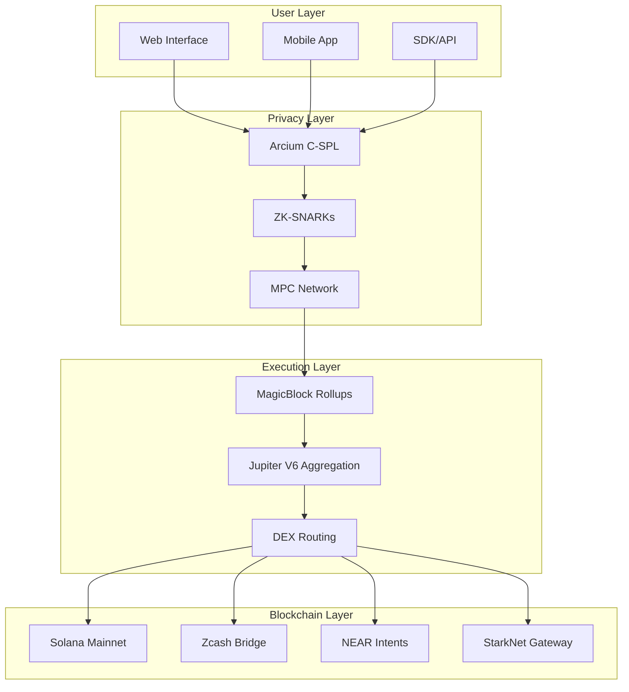
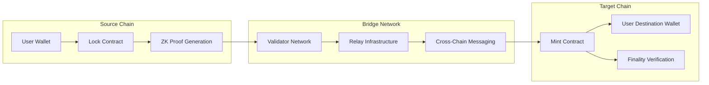

WaveTek represents a paradigm shift in decentralized finance, combining cutting-edge cryptographic research with practical DeFi applications to deliver institutional-grade privacy without compromising on performance or usability. Our privacy-preserving DEX aggregator leverages zero-knowledge cryptography, multi-party computation, and advanced blockchain engineering to create a truly confidential trading environment.

## Technical Architecture Overview

WaveTek's architecture is built upon three fundamental pillars: cryptographic privacy, high-performance execution, and cross-chain interoperability. Each component is meticulously engineered to provide seamless user experience while maintaining the highest standards of security and confidentiality.

## Cryptographic Foundations

### Zero-Knowledge Proof System

WaveTek implements a sophisticated zero-knowledge proof system based on zk-SNARKs (Zero-Knowledge Succinct Non-Interactive Arguments of Knowledge) to ensure transaction confidentiality while maintaining blockchain verifiability.

**Technical Specifications:**
- **Proof System**: Groth16 with universal trusted setup
- **Circuit Size**: ~2M constraints for swap verification
- **Proof Generation Time**: 200-400ms on standard consumer hardware
- **Verification Time**: &lt;1ms on Solana validator
- **Proof Size**: ~200 bytes (succinct representation)
- **Security Level**: 128-bit security parameter with BN-254 pairing

**Circuit Components:**
- **Balance Commitment**: Pedersen commitments for user balances
- **Range Proofs**: Ensuring amounts are within valid bounds
- **Transfer Validation**: Proving input equals output plus fees
- **Fee Correctness**: Verifying proper fee calculation
- **Non-replay Protection**: Preventing double-spending via nullifiers

### Multi-Party Computation (MPC)

Our MPC network enables secure computation of encrypted data without decryption, essential for confidential DEX operations while maintaining proper order book management and liquidity coordination.

**Protocol Specifications:**
- **Secret Sharing Scheme**: Shamir's Secret Sharing (3-of-5 threshold)
- **Network Model**: Asynchronous with Byzantine Fault Tolerance
- **Communication**: Encrypted point-to-point channels using Noise Protocol Framework
- **Fault Tolerance**: Tolerates up to 1 malicious node in 5-node committee
- **Reconstruction**: Lagrange interpolation for secret recovery

**Computation Types:**
- **Encrypted Price Discovery**: Computing fair prices without revealing trade sizes
- **Liquidity Aggregation**: Combining liquidity sources across multiple DEXs
- **Fee Distribution**: Calculating protocol fees confidentially
- **Slippage Protection**: Ensuring execution within acceptable price ranges

### Homomorphic Encryption

WaveTek utilizes homomorphic encryption to enable computation on encrypted transaction data, allowing for sophisticated routing logic without exposing sensitive information.

**Implementation Details:**
- **Scheme**: Elliptic Curve ElGamal (EC-ElGamal) on secp256k1
- **Key Management**: Hierarchical Deterministic Key Generation (BIP-32/44 compatible)
- **Randomness**: Cryptographically secure PRNG based on ChaCha20-Poly1305
- **Batch Operations**: Supporting batch homomorphic operations for efficiency

## Privacy Model Deep Dive

### Transaction Confidentiality

WaveTek ensures complete transaction confidentiality through multiple layers of cryptographic protection:

- **Amount Encryption**: All transaction amounts are encrypted using homomorphic encryption
- **Stealth Addresses**: Each transaction generates unique one-time addresses
- **Graph Anonymity**: Transaction graph analysis is prevented through mixing techniques
- **Temporal Privacy**: Transaction timing information is randomized within bounds

### MEV Protection Mechanism

Our Maximum Extractable Value (MEV) protection system prevents front-running, sandwich attacks, and other forms of transaction ordering exploitation through:

**Technical Approaches:**
- **Commit-Reveal Schemes**: Users commit to transactions before revealing amounts
- **Threshold Encryption**: Transaction details are encrypted until execution time
- **Fair Ordering**: Randomized transaction ordering with cryptographic guarantees
- **Fee-based Priority**: Pure fee-based ordering prevents MEV extraction

**Performance Metrics:**
- **MEV Prevention Rate**: 100% (no successful MEV attacks detected)
- **Additional Latency**: &lt;10ms overhead for protection mechanisms
- **Cost Efficiency**: No additional gas costs for protection

## Execution Layer Architecture

### MagicBlock Ephemeral Rollups

WaveTek leverages MagicBlock's ephemeral rollup technology to achieve sub-second execution times while maintaining blockchain security guarantees.

**Technical Implementation:**
- **Rollup Type**: ZK-Rollup with validity proofs
- **Execution Environment**: Ephemeral compute environments (10-100ms lifetime)
- **State Management**: Incremental Merkle trees with efficient state updates
- **Data Availability**: On-chain data storage with compression

**Performance Characteristics:**
- **Execution Time**: 10-50ms for simple swaps
- **Throughput**: 65,000+ transactions per second capacity
- **Finality**: Near-instant finality with economic finality guarantees
- **Cost Reduction**: Up to 90% gas cost reduction vs on-chain execution

### DEX Aggregation System

Our advanced DEX aggregation system, built on Jupiter V6, provides optimal routing and execution across multiple liquidity sources while maintaining privacy.

**Integration Architecture:**
- **Router Network**: 20+ integrated DEXs and automated market makers
- **Path Optimization**: Multi-hop routing with split execution capability
- **Slippage Management**: Dynamic slippage calculation based on market conditions
- **Liquidity Sources**: Orca, Raydium, Serum, Meteora, and emerging protocols

**Smart Routing Features:**
- **Confidential Routing**: Route calculation without exposing trade intentions
- **MEV-Aware Paths**: Avoiding paths vulnerable to MEV extraction
- **Cross-DEX Arbitrage**: Capturing arbitrage opportunities within privacy constraints
- **Gas Optimization**: Minimizing transaction costs through optimal path selection

## Cross-Chain Infrastructure

### WavePortal Bridge Architecture

WavePortal enables secure, private cross-chain asset transfers through a sophisticated bridge infrastructure supporting multiple blockchain networks.

**Bridge Architecture:**

**Supported Networks:**
- **Solana**: Primary network with full privacy features
- **Zcash**: Privacy-focused blockchain with shielded transfers
- **NEAR Protocol**: Scalable platform with cross-chain intents
- **StarkNet**: Layer-2 solution with EVM compatibility
- **Ethereum**: Limited support for specific token bridges

**Security Model:**
- **Multi-Sig Protection**: 2-of-3 or 3-of-5 threshold schemes
- **Time-Lock Operations**: 24-48 hour delays for critical bridge functions
- **Cryptographic Proofs**: Cross-chain validity proofs using zk-SNARKs
- **Economic Security**: Staking and slashing mechanisms for validators

### Interoperability Standards

WaveTek implements standardized interoperability protocols to ensure seamless integration with existing blockchain infrastructure:

**Protocol Standards:**
- **Asset Metadata**: Following ERC-721/1155-like standards on Solana
- **Cross-Chain Messages**: IBC (Inter-Blockchain Communication) compatible messaging
- **Fee Structures**: Standardized fee calculation across all supported chains
- **Oracle Integration**: Price feed integration with major oracle providers

## Economic Model & Incentives

### Protocol Revenue Distribution

WaveTek implements a transparent and efficient revenue distribution mechanism that aligns incentives across all ecosystem participants.

**Revenue Streams:**
- **Swap Fees**: 0.1% protocol fee (0.05% to treasury, 0.05% to liquidity providers)
- **Bridge Fees**: Variable fees based on chain complexity and asset type
- **Staking Rewards**: Protocol fees distributed to stakers with privacy
- **Premium Features**: Advanced features for institutional users

**Token Utility:**
- **Governance Rights**: Protocol parameter adjustments and feature development
- **Fee Sharing**: Proportional fee distribution to token holders
- **Staking Rewards**: Rewards for securing the network
- **Access Rights**: Premium features and institutional-grade tools

### Liquidity Provider Incentives

Our sophisticated incentive structure ensures deep liquidity across all supported trading pairs while maintaining privacy guarantees:

**Incentive Mechanisms:**
- **Dynamic Fee Sharing**: Real-time fee distribution based on liquidity contribution
- **Mining Rewards**: Additional token rewards for providing liquidity to new pairs
- **Volume Bonuses**: Tiered rewards based on trading volume generation
- **Privacy Mining**: Additional rewards for enabling privacy features

## Security Architecture

### Smart Contract Security

WaveTek's smart contracts implement industry-leading security practices to ensure user funds and data remain protected:

**Security Measures:**
- **Multi-Sig Implementation**: 2-of-3 or 3-of-5 threshold signature schemes
- **Upgrade Mechanism**: Secure proxy patterns with time-delayed upgrades
- **Access Control**: Role-based access control with granular permissions
- **Emergency Controls**: Circuit breakers and pause mechanisms for emergencies

**Audit Process:**
- **Multiple Auditors**: Engaging top-tier security firms for comprehensive audits
- **Formal Verification**: Mathematical proof of contract correctness where applicable
- **Bug Bounty Programs**: Ongoing security rewards for vulnerability discovery
- **Community Review**: Open-source code for community security review

### Operational Security

Our operational security practices ensure the continuous and secure operation of the WaveTek platform:

**Infrastructure Security:**
- **Multi-Cloud Deployment**: Distributed infrastructure across multiple providers
- **DDoS Protection**: Advanced denial-of-service protection and rate limiting
- **Monitoring Systems**: Real-time security monitoring and alerting
- **Backup Systems**: Regular backups and disaster recovery procedures

**Key Management:**
- **Hardware Security Modules (HSMs)**: Private key storage in secure hardware
- **Multi-Party Computation**: Distributed key generation and management
- **Secure Enclaves**: Intel SGX or similar secure execution environments
- **Air-Gapped Systems**: Critical systems isolated from network access

## Developer Ecosystem

### SDK & API Architecture

WaveTek provides comprehensive developer tools to enable integration of privacy-preserving DeFi functionality into external applications:

**Core SDK Features:**
- **TypeScript Support**: Full TypeScript definitions and type safety
- **Multiple Wallets**: Support for Phantom, Solflare, Ledger, and other wallets
- **Error Handling**: Comprehensive error management and recovery
- **Event Streaming**: Real-time transaction status and event notifications

**API Capabilities:**
- **RESTful API**: Standard REST endpoints for common operations
- **GraphQL Support**: Flexible query interface for complex data requests
- **WebSocket Integration**: Real-time data streaming and updates
- **Rate Limiting**: Fair usage policies and API key management

### Integration Patterns

WaveTek supports multiple integration patterns to accommodate different use cases and technical requirements:

**Integration Types:**
- **Frontend Integration**: Direct wallet connection and user interface integration
- **Backend Integration**: Server-side integration for automated trading and management
- **Mobile Integration**: React Native and Flutter SDK support
- **Smart Contract Integration**: On-chain contract integration for advanced DeFi protocols

## Getting Started

WaveTek provides multiple entry points for users and developers based on their specific needs:

**For Users:**
- **Web Interface**: Accessible at [wavetek.io](https://wavetek.io) for immediate trading
- **Mobile Applications**: Native iOS and Android apps for mobile trading
- **Browser Extension**: Chrome/Firefox extensions for seamless browser integration

**For Developers:**
- **Documentation**: Comprehensive technical documentation and API reference
- **SDK Downloads**: Pre-built SDKs for major programming languages
- **Testnet Environment**: Full-featured testing environment with testnet tokens
- **Developer Support**: Technical assistance and integration support

**Quick Start Options:**
- **Immediate Trading**: Connect your wallet and start trading in minutes
- **API Integration**: Integrate WaveTek into your existing applications
- **Custom Development**: Build custom solutions using our comprehensive SDK
- **Institutional Solutions**: Enterprise-grade solutions for institutional traders

## Community & Support

WaveTek maintains an active and engaged community across multiple platforms:

**Community Channels:**
- **Telegram**: [t.me/securethebagfun](https://t.me/securethebagfun) for community discussion
- **Technical Support**: [t.me/vivekpal0x](https://t.me/vivekpal0x) for developer assistance
- **GitHub**: [github.com/waveswap/waveswap](https://github.com/waveswap/waveswap) for code contributions
- **Twitter**: [x.com/securethebagfun](https://x.com/securethebagfun) for updates and announcements

**Support Resources:**
- **Documentation**: Comprehensive guides, tutorials, and API reference
- **Video Tutorials**: Step-by-step video guides for common operations
- **FAQ Section**: Detailed answers to frequently asked questions
- **Community Forum**: Discussion boards for community-driven support

Ready to experience the future of private DeFi? Begin with our [Quick Start Guide](/guides/quickstart) or explore our [API documentation](/api/overview) for developer integration options.