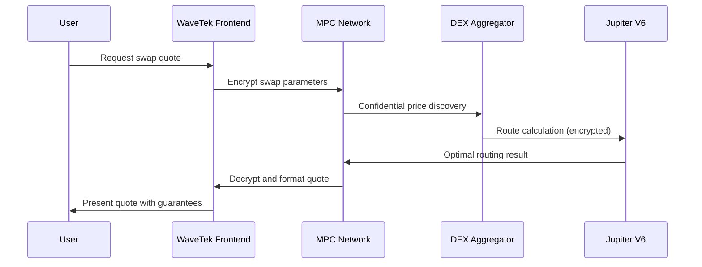

This comprehensive guide will walk you through setting up WaveTek and executing your first privacy-preserving swap with detailed technical explanations of each step.

## Technical Prerequisites

### System Requirements

**Hardware Requirements:**
- **RAM**: Minimum 4GB, recommended 8GB for optimal zk-proof generation performance
- **CPU**: Modern 64-bit processor with AES-NI support for cryptographic operations
- **Network**: Stable internet connection with &lt;100ms latency for optimal MPC communication
- **Storage**: 500MB available disk space for browser cache and wallet data

**Software Requirements:**
- **Browser**: Chrome 90+, Firefox 88+, Safari 14+, Edge 90+ (WebAssembly support required)
- **Wallet**: Phantom, Solflare, Backpack, or Ledger (hardware wallet support)
- **Operating System**: Windows 10+, macOS 10.15+, Ubuntu 18.04+, or equivalent

### Network Configuration

**RPC Endpoints:**
- **Primary RPC**: `https://api.mainnet-beta.solana.com` (official Solana Labs)
- **WaveTek RPC**: `https://rpc.wavetek.io` (optimized for privacy operations)
- **Fallback RPCs**: Multiple geographically distributed endpoints for reliability

**Network Settings:**
- **Commitment Level**: `confirmed` (default) or `finalized` for maximum security
- **Preflight Checks**: Enabled for transaction validation
- **Max Retries**: 3 automatic retries for failed transactions
- **Confirmation Timeout**: 30 seconds maximum wait time

## Wallet Setup and Connection

### Wallet Installation

**Phantom Wallet Setup (Recommended):**
```bash
# Install Phantom browser extension
# Chrome: https://phantom.app/download
# Firefox: https://phantom.app/download
# Edge: https://phantom.app/download
```

**Security Configuration:**
- **Create New Wallet** or import existing wallet
- **Set Strong Password** (minimum 12 characters, mixed case, numbers, symbols)
- **Enable Auto-Lock** (5-15 minutes recommended)
- **Backup Seed Phrase** securely (write down, store offline)
- **Enable Two-Factor Authentication** if available

**Advanced Settings:**
- **Network**: Mainnet (not Devnet/Testnet for production use)
- **RPC URL**: Custom WaveTek RPC for optimal performance
- **Transaction Auto-Confirm**: Enabled for faster execution
- **Hardware Wallet Support**: Enable if using Ledger/Trezor

### Wallet Connection Process

**Technical Connection Flow:**
```typescript
// WaveTek wallet connection implementation
const connectWallet = async () => {
  try {
    // Request wallet connection
    const response = await window.solana.connect();

    // Validate network compatibility
    if (response.publicKey && window.solana.networkVersion === 'mainnet-beta') {
      // Generate unique session identifier
      const sessionId = crypto.randomUUID();

      // Establish secure communication channel
      const encryptedChannel = await establishSecureChannel(response.publicKey);

      return {
        publicKey: response.publicKey.toString(),
        sessionId,
        channel: encryptedChannel
      };
    }
  } catch (error) {
    console.error('Wallet connection failed:', error);
    throw new Error('Unable to establish secure wallet connection');
  }
};
```

**Security Measures During Connection:**
- **Origin Verification**: Validates request origin to prevent phishing
- **Message Signing**: Cryptographic verification of connection request
- **Session Encryption**: End-to-end encryption for all communications
- **Rate Limiting**: Prevents brute force connection attempts

## Token Selection and Balance Management

### Token Discovery and Selection

**Supported Token Types:**
- **Native SPL Tokens**: Standard SPL tokens with full privacy support
- **Confidential Tokens**: C-SPL enabled tokens with encrypted balances
- **Bridge Tokens**: Cross-chain wrapped tokens via WavePortal
- **NFT Tokens**: Limited support for confidential NFT transfers

**Token Metadata Structure:**
```typescript
interface TokenInfo {
  mint: string;           // Token mint address
  name: string;          // Display name
  symbol: string;        // Trading symbol
  decimals: number;      // Decimal precision
  logoURI: string;       // Token icon URL
  isConfidential: boolean; // C-SPL support status
  bridgeChain?: string;  // Origin chain for bridged tokens
  liquidityDepth: number; // Available liquidity in USD
  priceImpact: number;   // Expected price impact
}
```

**Balance Query Process:**
- **Public Balance**: Standard on-chain balance query
- **Private Balance**: Encrypted balance via C-SPL if enabled
- **Combined Balance**: Aggregated total across all token types
- **Available Balance**: Liquidity after accounting for pending transactions

### Advanced Balance Management

**Confidential Balance Queries:**
```typescript
const getConfidentialBalance = async (mint: string, userKey: string) => {
  // Generate zero-knowledge proof for balance query
  const proof = await generateBalanceProof(userKey, mint);

  // Query private balance through MPC network
  const encryptedBalance = await queryPrivateBalance({
    mint,
    proof,
    userPublicKey: userKey
  });

  // Decrypt balance locally
  const balance = await decryptBalance(encryptedBalance, userKey);

  return {
    amount: balance,
    isPrivate: true,
    lastUpdated: Date.now()
  };
};
```

## Swap Quote Generation and Analysis

### 1. Privacy-Preserving Quote System

**Quote Generation Process:**


**Technical Implementation Details:**
- **Parameter Encryption**: Swap amounts are encrypted using homomorphic encryption
- **MPC Computation**: Multiple parties compute optimal routes without seeing amounts
- **Route Optimization**: Jupiter V6 integration for best execution paths
- **Slippage Protection**: Dynamic slippage calculation based on market conditions
- **MEV Protection**: Zero-knowledge proofs prevent front-running

### 2. Quote Analysis and Validation

**Quote Data Structure:**
```typescript
interface SwapQuote {
  // Basic quote information
  inputToken: TokenInfo;
  outputToken: TokenInfo;
  inputAmount: string;     // Raw amount in smallest units
  outputAmount: string;    // Expected output amount

  // Pricing information
  exchangeRate: string;    // Precise exchange rate
  priceImpact: number;     // Percentage price impact
  slippage: number;        // Expected slippage

  // Fee breakdown
  networkFee: number;      // Solana network fee (lamports)
  protocolFee: number;     // WaveTek protocol fee (lamports)
  dexFees: DEXFee[];       // Individual DEX fees
  totalFees: number;       // Total fee amount

  // Privacy guarantees
  privacyMode: 'standard' | 'enhanced' | 'maximum';
  encryptionLevel: number; // Cryptographic security level
  mevProtection: boolean;  // MEV protection enabled

  // Execution details
  route: RouteStep[];      // Execution path (encrypted)
  estimatedTime: number;   // Estimated execution time (ms)
  confidence: number;      // Execution confidence score

  // Validity period
  validUntil: number;      // Quote expiration timestamp
  refreshInterval: number; // Auto-refresh interval
}
```

## Transaction Execution and Monitoring

### 1. Privacy-Preserving Transaction Construction

**Transaction Assembly Process:**
```typescript
const constructPrivateTransaction = async (quote: SwapQuote, userKey: string) => {
  // Generate zero-knowledge proof for swap
  const swapProof = await generateSwapProof({
    inputAmount: quote.inputAmount,
    outputAmount: quote.outputAmount,
    userPublicKey: userKey,
    route: quote.route
  });

  // Create confidential transaction payload
  const confidentialTx = await createConfidentialTransaction({
    proof: swapProof,
    encryptedAmounts: await encryptSwapAmounts(quote),
    nullifiers: await generateNullifiers(userKey),
    commitment: await generateCommitment(quote)
  });

  // Add privacy metadata
  const metadata = {
    privacyMode: quote.privacyMode,
    encryptionLevel: quote.encryptionLevel,
    mevProtection: quote.mevProtection,
    timestamp: Date.now()
  };

  return {
    transaction: confidentialTx,
    metadata,
    expectedOutputs: quote.outputAmount
  };
};
```

### 2. Multi-Party Execution Protocol

**MPC Execution Flow:**
- **Transaction Commitment**: User commits to encrypted transaction
- **MPC Computation**: Multiple parties validate without decryption
- **Proof Verification**: Zero-knowledge proofs are verified
- **State Update**: Encrypted state changes are applied
- **Receipt Generation**: Confidential execution receipt is issued

**Technical Execution Details:**
- **Proof Generation**: 200-400ms on standard hardware
- **MPC Verification**: 10-50ms across validator network
- **State Updates**: Sub-100ms commitment to blockchain
- **Finality**: Near-instant with economic finality guarantees

## Confirmation and Balance Updates

### 1. Transaction Confirmation Process

**Confirmation States:**
```typescript
enum TransactionStatus {
  INITIALIZING = 'initializing',      // Transaction preparation
  COMMITTED = 'committed',           // Committed to MPC network
  PROCESSING = 'processing',         // MPC computation in progress
  VERIFYING = 'verifying',          // ZK proof verification
  CONFIRMING = 'confirming',         // Blockchain confirmation
  COMPLETED = 'completed',          // Fully executed
  FAILED = 'failed'                 // Execution failed
}
```

**Real-time Status Monitoring:**
```typescript
const monitorTransaction = async (signature: string, onUpdate: (status: TransactionStatus, details: any) => void) => {
  let currentStatus = TransactionStatus.INITIALIZING;

  // WebSocket connection for real-time updates
  const ws = new WebSocket(`wss://api.wavetek.io/tx/${signature}`);

  ws.onmessage = (event) => {
    const update = JSON.parse(event.data);

    switch (update.type) {
      case 'committed':
        currentStatus = TransactionStatus.COMMITTED;
        onUpdate(currentStatus, { committedAt: update.timestamp });
        break;

      case 'proof_verified':
        currentStatus = TransactionStatus.VERIFYING;
        onUpdate(currentStatus, { proofValid: update.valid });
        break;

      case 'confirmed':
        currentStatus = TransactionStatus.CONFIRMED;
        onUpdate(currentStatus, {
          blockHeight: update.blockHeight,
          slot: update.slot
        });
        break;

      case 'completed':
        currentStatus = TransactionStatus.COMPLETED;
        ws.close();
        onUpdate(currentStatus, {
          finalOutputs: update.outputs,
          totalFees: update.fees
        });
        break;
    }
  };

  return currentStatus;
};
```

### 2. Private Balance Updates

**Encrypted Balance Management:**
```typescript
const updatePrivateBalance = async (
  tokenMint: string,
  userKey: string,
  transactionSignature: string
) => {
  // Generate balance update proof
  const updateProof = await generateBalanceUpdateProof({
    tokenMint,
    userKey,
    transactionSignature
  });

  // Query updated balance through MPC
  const updatedBalance = await queryUpdatedBalance({
    tokenMint,
    userKey,
    updateProof
  });

  // Decrypt and validate new balance
  const decryptedBalance = await decryptBalance(updatedBalance, userKey);

  return {
    previousBalance: await getPreviousBalance(tokenMint, userKey),
    newBalance: decryptedBalance,
    change: calculateBalanceChange(decryptedBalance),
    timestamp: Date.now()
  };
};
```

## Advanced Configuration Options

### 1. Privacy Level Customization

**Privacy Mode Configuration:**
- **Standard**: Basic encryption, faster execution, lower fees
- **Enhanced**: Multi-layer encryption, balanced performance
- **Maximum**: Full privacy suite, highest security, premium fees

**Technical Trade-offs:**
```typescript
interface PrivacyConfig {
  mode: 'standard' | 'enhanced' | 'maximum';

  // Encryption settings
  encryptionLevel: number;        // 128-bit, 192-bit, or 256-bit
  proofComplexity: number;        // ZK proof complexity factor

  // Performance settings
  maxExecutionTime: number;       // Maximum acceptable execution time
  priorityFee: number;           // Additional priority fee for faster execution

  // MEV protection
  mevProtectionLevel: 'basic' | 'advanced' | 'maximum';
  commitRevealDelay: number;     // Delay between commit and reveal phases

  // Network settings
  mpcNodes: number;              // Number of MPC nodes to involve
  redundancyLevel: number;       // Redundancy for fault tolerance
}
```

### 2. Batch Operations Support

**Multi-Transaction Execution:**
```typescript
const executeBatchSwaps = async (swaps: SwapRequest[]) => {
  // Generate batch proof for all transactions
  const batchProof = await generateBatchProof(swaps);

  // Execute all transactions atomically
  const batchResult = await executeAtomically({
    transactions: swaps,
    proof: batchProof,
    atomicity: true  // All or nothing execution
  });

  return {
    successes: batchResult.successful,
    failures: batchResult.failed,
    totalExecutionTime: batchResult.executionTime,
    totalFees: batchResult.feesPaid
  };
};
```

## Troubleshooting and Debugging

### 1. Common Issues and Solutions

**Connection Issues:**
- **Problem**: Wallet connection timeout
- **Solution**: Check RPC endpoints, increase timeout to 60 seconds
- **Technical**: Verify wallet extension is active and permissions granted

**Balance Display Issues:**
- **Problem**: Private balance not showing
- **Solution**: Ensure C-SPL tokens are supported, check MPC network status
- **Technical**: Verify ZK proof generation capability in browser

**Transaction Failures:**
- **Problem**: Swap execution failing
- **Solution**: Check slippage tolerance, verify token liquidity, increase priority fees
- **Technical**: Examine transaction logs, verify MPC network connectivity

**Performance Issues:**
- **Problem**: Slow proof generation
- **Solution**: Enable hardware acceleration, close unnecessary browser tabs
- **Technical**: Use Web Workers for parallel proof computation

### 2. Debug Mode Configuration

**Enable Debug Logging:**
```typescript
// Enable comprehensive debug logging
const enableDebugMode = () => {
  localStorage.setItem('wavetek_debug', 'true');
  localStorage.setItem('wavetek_log_level', 'verbose');
  localStorage.setItem('wavetek_telemetry', 'enabled');
};

// Debug data collection
const collectDebugInfo = async () => {
  return {
    userAgent: navigator.userAgent,
    webassemblySupport: !!window.WebAssembly,
    hardwareConcurrency: navigator.hardwareConcurrency,
    memoryUsage: performance.memory ? performance.memory.usedJSHeapSize : null,
    networkLatency: await measureNetworkLatency(),
    mpcConnectivity: await testMPCConnectivity(),
    zkProofPerformance: await benchmarkZKProofs()
  };
};
```

## Next Steps and Advanced Features

### 1. Cross-Chain Operations

**WavePortal Bridge Usage:**
- **Select Bridge**: Access cross-chain bridge interface
- **Choose Chains**: Select source and destination blockchains
- **Configure Privacy**: Set privacy level for bridge operation
- **Execute Transfer**: Submit cross-chain transaction
- **Monitor Progress**: Track transfer across multiple blockchains

### 2. Staking and Yield Generation

**WaveStake Privacy Features:**
- **Confidential Staking**: Stake amounts remain private
- **Private Rewards**: Reward distribution with confidentiality
- **Flexible Lock Periods**: Customizable staking durations
- **Compound Privacy**: Compound rewards privately

### 3. API Integration

**Developer Integration:**
```typescript
// SDK integration example
import { WaveTekSDK } from '@waveswap/sdk';

const sdk = new WaveTekSDK({
  network: 'mainnet',
  privacyMode: true,
  wallet: phantomWallet
});

// Execute private swap via SDK
const result = await sdk.swap({
  inputToken: 'So11111111111111111111111111111111111111112', // SOL
  outputToken: 'EPjFWdd5Au17hunJyHyer4hoi6UcsbkxNmnpDnJ55ip2', // USDC
  inputAmount: '10000000', // 0.01 SOL
  privacyMode: 'enhanced'
});
```

## Support and Community Resources

### 1. Technical Support Channels

**Priority Support:**
- **Telegram**: [t.me/vivekpal0x](https://t.me/vivekpal0x) for direct technical assistance
- **GitHub Issues**: [github.com/waveswap/waveswap/issues](https://github.com/waveswap/waveswap/issues) for bug reports
- **Documentation**: Comprehensive guides and API reference

**Community Support:**
- **Telegram Group**: [t.me/securethebagfun](https://t.me/securethebagfun) for community discussion
- **Twitter Updates**: [x.com/securethebagfun](https://x.com/securethebagfun) for platform updates
- **Developer Discord**: Advanced integration support

### 2. Additional Resources

**Educational Content:**
- **Technical Whitepaper**: Detailed cryptography and protocol specifications
- **Video Tutorials**: Step-by-step visual guides for advanced features
- **Code Examples**: Sample applications and integration patterns
- **Security Audits**: Public audit reports and security assessments

**Development Tools:**
- **Testnet Environment**: Full-featured testing with testnet tokens
- **SDK Documentation**: Comprehensive API reference and examples
- **Testing Suite**: Automated testing tools for integration verification
- **Performance Monitoring**: Real-time performance metrics and optimization

Congratulations! You've successfully completed the WaveTek Quick Start Guide with comprehensive technical detail. You now have the knowledge to execute privacy-preserving swaps, understand the underlying technology, and integrate WaveTek into your own applications.