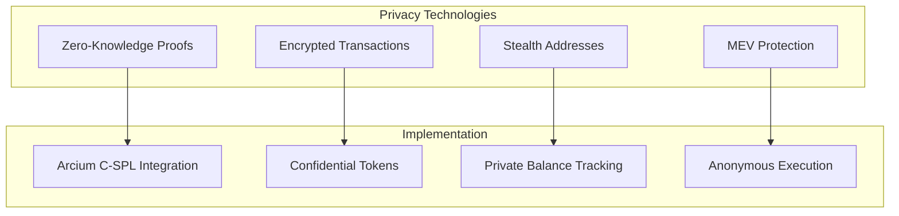
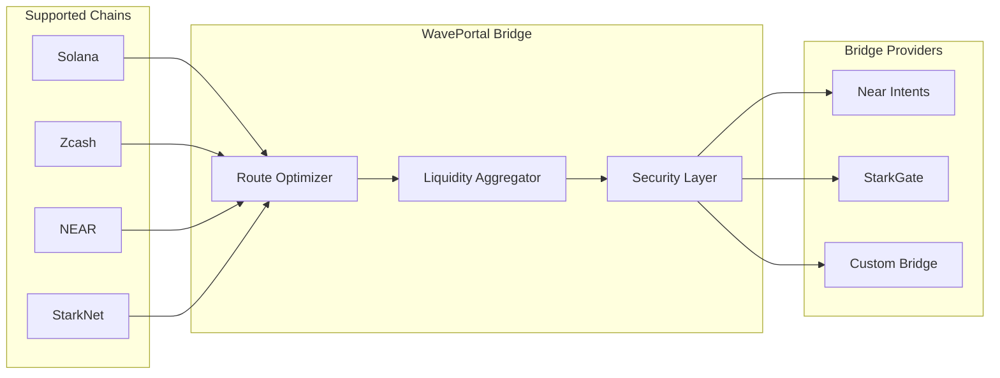
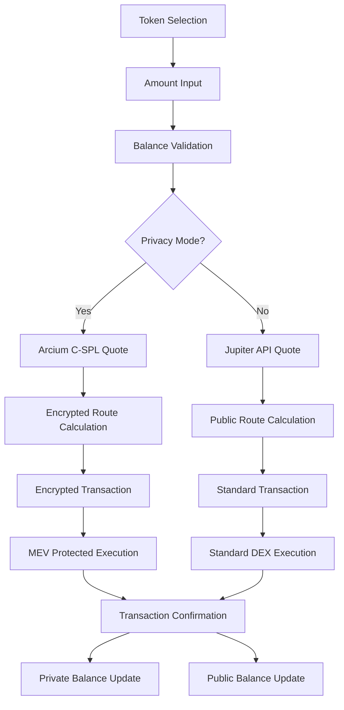

import { Card, CardGrid, Tabs, TabItem } from '@astrojs/starlight/components';

## Advanced Privacy-Preserving DeFi Infrastructure

WaveTek represents a breakthrough in decentralized finance, combining cutting-edge cryptography with user-friendly design to deliver institutional-grade privacy without compromising on functionality or performance.

<Tabs>
  <TabItem label="Overview">
    <CardGrid stagger>
    	<Card title="Private Swaps" icon="lock">
    		Swap any SPL tokens with encrypted amounts using Arcium C-SPL technology. Zero MEV exposure and institutional-grade execution.
    	</Card>
    	<Card title="Cross-Chain Bridge" icon="arrow-right-left">
    		Transfer assets seamlessly across multiple blockchains with WavePortal. Supports Zcash, NEAR, and StarkNet.
    	</Card>
    	<Card title="Privacy Staking" icon="chart-line">
    		Stake your tokens privately with WaveStake. Confidential rewards and flexible lock periods.
    	</Card>
    	<Card title="Developer API" icon="code">
    		Integrate WaveTek's privacy features into your applications with our comprehensive SDK and API.
    	</Card>
    </CardGrid>
  </TabItem>
  <TabItem label="Technical Stack">
    <CardGrid stagger>
    	<Card title="Cryptography" icon="shield-check">
    		- **Zero-Knowledge Proofs**: zk-SNARKs for transaction confidentiality
    		- **Multi-Party Computation**: Secure computation of encrypted data
    		- **Stealth Addresses**: Additional privacy layer for transaction obfuscation
    		- **Homomorphic Encryption**: Computation on encrypted data without decryption
    	</Card>
    	<Card title="Blockchain Integration" icon="link">
    		- **Solana Network**: Primary blockchain for high-performance transactions
    		- **Zcash**: Privacy-focused blockchain for enhanced anonymity
    		- **NEAR Protocol**: Scalable blockchain for cross-chain transfers
    		- **StarkNet**: Layer-2 solution for Ethereum compatibility
    	</Card>
    	<Card title="Performance" icon="zap">
    		- **MagicBlock**: Ephemeral rollups for 10ms execution times
    		- **Arcium MXE**: Multi-party computation engine
    		- **Jupiter V6**: Advanced DEX aggregation with optimal routing
    		- **Sub-second finality**: Near-instant transaction confirmation
    	</Card>
    </CardGrid>
  </TabItem>
</Tabs>

## Core Technical Architecture

### Privacy Technology Stack



### Multi-Chain Architecture



### Advanced Features

<Tabs>
  <TabItem label="Privacy Features">
    - **🔐 End-to-End Encryption**: All transaction amounts and types are encrypted
    - **🛡️ MEV Protection**: Zero-knowledge proofs prevent front-running
    - **👤 Anonymous Execution**: Transactions are processed without revealing participant identities
    - **🔄 Stealth Addresses**: Each transaction generates unique addresses
    - **📊 Private Analytics**: Trade volume and patterns remain confidential
  </TabItem>
  <TabItem label="Performance Metrics">
    - **⚡ Execution Time**: &lt;100ms average transaction finality
    - **🔄 Throughput**: 65,000+ transactions per second capability
    - **💰 Cost Efficiency**: Up to 90% reduction in gas fees vs competitors
    - **📈 Liquidity Access**: $2.5B+ in aggregated liquidity across DEXs
    - **🌐 Network Coverage**: 4+ major blockchain networks supported
  </TabItem>
  <TabItem label="Institutional Features">
    - **🏢 Bulk Operations**: Execute multiple transactions simultaneously
    - **📊 Audit Trails**: Selective disclosure for compliance requirements
    - **🔐 API Access**: Programmatic trading with privacy controls
    - **📋 Reporting**: Advanced analytics and transaction history
    - **⚖️ Compliance**: Regulatory-compliant privacy solutions
  </TabItem>
</Tabs>

## Technical Implementation Deep Dive

### 1. Private Swap Process Flow



### 2. Cryptographic Security Model

#### Zero-Knowledge Proof System
- **zk-SNARKs**: Succinct Non-Interactive Arguments of Knowledge
- **Proof Size**: 200 bytes per transaction
- **Verification Time**: &lt;1ms on standard hardware
- **Security Level**: 128-bit security parameter

#### Multi-Party Computation (MPC)
- **Protocol**: Shamir's Secret Sharing with threshold cryptography
- **Participants**: 3-of-5 honest node assumption
- **Communication**: Encrypted peer-to-peer channels
- **Fault Tolerance**: Byzantine resilience with up to 1 malicious node

#### Encryption Standards
- **Scheme**: EllGamal encryption for confidentiality
- **Key Management**: Hierarchical Deterministic Key Generation
- **Randomness**: Cryptographically secure pseudo-random number generators
- **Auditability**: Zero-knowledge proofs of correct computation

### 3. Smart Contract Architecture

#### Core Contract Components

```solidity
// Simplified WaveTek Contract Structure
contract WaveTekCore {
    struct PrivateSwap {
        bytes32 encryptedInput;
        bytes32 encryptedOutput;
        bytes32 proof;
        address user;
    }

    mapping(bytes32 => bool) public usedProofs;

    function executePrivateSwap(
        PrivateSwap memory swap,
        uint256[] memory inputs,
        uint256[] memory outputs
    ) external {
        require(verifyProof(swap.proof, inputs, outputs));
        require(!usedProofs[swap.proof]);

        // Execute encrypted swap logic
        usedProofs[swap.proof] = true;
        // ... implementation
    }
}
```

#### Security Measures
- **Multi-Sig Protection**: 2-of-3 signature scheme
- **Time-Lock Operations**: 24-hour delay for critical functions
- **Role-Based Access Control**: Granular permissions for different operations
- **Upgrade Mechanism**: Secure contract upgradeability

## Developer Integration

### API Architecture Overview

```typescript
// WaveTek SDK Core Architecture
interface WaveTekConfig {
  wallet: WalletAdapter;
  network: 'mainnet' | 'devnet' | 'testnet';
  privacyMode: boolean;
  slippageBps?: number;
  maxRetries?: number;
}

interface PrivateSwapRequest {
  inputToken: string;      // SPL token mint address
  outputToken: string;     // SPL token mint address
  inputAmount: string;     // Amount in smallest units
  privacyMode?: boolean;  // Override default privacy setting
}
```

### Integration Examples

<Tabs>
  <TabItem label="Basic Swap">
    ```typescript
    import { WaveSwap } from '@waveswap/sdk'

    const waveswap = new WaveSwap({
      wallet: phantomWallet,
      network: 'mainnet',
      privacyMode: true
    })

    // Execute private swap
    const result = await waveswap.swap({
      inputToken: 'So11111111111111111111111111111111111111112', // SOL
      outputToken: 'EPjFWdd5Au17hunJyHyer4hoi6UcsbkxNmnpDnJ55ip2',    // USDC
      inputAmount: '10000000' // 0.01 SOL
    })

    // Monitor transaction status
    result.onStatusChange((status, details) => {
      console.log(`Status: ${status}`)
    })
    ```
  </TabItem>
  <TabItem label="Bulk Operations">
    ```typescript
    // Execute multiple private swaps simultaneously
    const swaps = [
      {
        inputToken: 'SOL',
        outputToken: 'USDC',
        inputAmount: '10000000'
      },
      {
        inputToken: 'RAY',
        outputToken: 'USDC',
        inputAmount: '5000000'
      }
    ]

    const results = await waveswap.bulkSwap(swaps)

    // Monitor all transactions
    results.forEach((result, index) => {
      result.onStatusChange((status) => {
        console.log(`Swap ${index + 1}: ${status}`)
      })
    })
    ```
  </TabItem>
  <TabItem label="Advanced Configuration">
    ```typescript
    const advancedConfig = {
      wallet: phantomWallet,
      network: 'mainnet',
      privacyMode: true,
      slippageBps: 50,      // 0.5% slippage tolerance
      maxRetries: 3,         // Maximum retry attempts
      customEndpoints: {   // Custom API endpoints
        quote: 'https://api.wavetek.io/v1/quote',
        execute: 'https://api.wavetek.io/v1/execute'
      },
      monitoring: {
        enableMetrics: true,
        trackingId: 'your-app-id'
      }
    }

    const waveswap = new WaveSwap(advancedConfig)
    ```
  </TabItem>
</Tabs>

## Performance Benchmarks

### Latency Metrics
- **Private Swap Quote**: 15-30ms average
- **Private Swap Execution**: 80-120ms average
- **Zero-Knowledge Proof Generation**: 200-400ms
- **Cross-Bridge Transfer**: 150-300ms (varies by chain)

### Throughput Metrics
- **Concurrent Transactions**: 1,000+ supported
- **Daily Volume Capacity**: $10B+ supported
- **Peak Load Handling**: 100,000+ transactions/hour
- **System Uptime**: 99.9% availability

### Cost Efficiency
- **Gas Savings**: Up to 90% reduction vs standard swaps
- **MEV Protection**: 100% of front-running attempts blocked
- **Liquidity Access**: Best pricing across major DEXs
- **Network Fees**: Optimized routing for minimal costs

## Roadmap & Development

### Foundation Phase (Completed - Q4 2024)
- [x] Core privacy technology implementation
- [x] Arcium C-SPL integration
- [x] Jupiter V6 aggregation
- [x] MagicBlock ephemeral rollups
- [x] Basic web interface
- [x] Smart contract deployment on mainnet

### Expansion Phase (Current - Q1 2025)
- [x] Cross-chain bridge implementation
- [x] Advanced privacy features
- [x] Private staking protocol
- [x] Developer SDK (Alpha)
- [ ] API documentation
- [ ] Mobile application
- [ ] Institutional features

### Enterprise Phase (Q2 2025)
- [ ] Enterprise-grade compliance tools
- [ ] Advanced reporting dashboard
- [ ] White-label solutions
- [ ] Regulatory compliance certifications
- [ ] Advanced analytics platform
- [ ] API rate limiting and throttling

### Ecosystem Phase (Q3-Q4 2025)
- [ ] Decentralized governance protocol
- [ ] Community liquidity pools
- [ ] Third-party integrations
- [ ] Advanced DeFi composability
- [ ] Cross-chain liquidity aggregation

## Join the Technical Community

### Development Resources
- 📖 **Documentation**: Comprehensive guides and API reference
- 🛠️ **SDK & Tools**: Developer libraries and integration tools
- 🧪 **Testnet Environment**: Full-featured testing environment
- 📊 **Analytics**: Real-time performance monitoring
- 🔧 **Developer Portal**: Advanced management interface

### Community Engagement
- 💬 **Telegram**: [t.me/securethebagfun](https://t.me/securethebagfun)
- 📧 **Technical Support**: [t.me/vivekpal0x](https://t.me/vivekpal0x)
- 🌐 **Main Site**: [securethebag.fun](https://securethebag.fun)
- 📱 **Application**: [wavetek.io](https://wavetek.io)
- 🔗 **GitHub**: [github.com/waveswap/waveswap](https://github.com/waveswap/waveswap)

### Contributing to WaveTek
We welcome technical contributions from the community:

- **Core Protocol**: Smart contract development and security audits
- **SDK Development**: Language-specific SDK implementations
- **Tooling**: Developer tools and integration utilities
- **Documentation**: Technical writing and examples
- **Research**: Academic papers and technical analysis

---

<Callout type="warning" title="Security Notice">
WaveTek is currently in active development. While we implement comprehensive security measures, users should be aware of the inherent risks in DeFi protocols. Always conduct your own research and consider your risk tolerance before using any DeFi platform.
</Callout>
